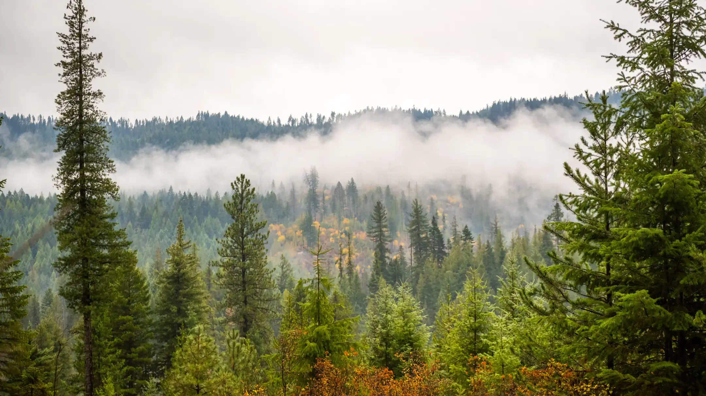

# IFC Spatial Toolset Workshop 2026

[](https://www.intermtnforestcoop.com/meetingsworkshops.html)
[](https://IFC-UIDAHO.github.io/Workshop2026)
[](https://www.intermtnforestcoop.com/meetingsworkshops.html)

> A live online workshop for IFC members on spatial toolsets and upcoming analytics: **SDImax**, **Forest Site Type**, **RGT**, and sneak peeks at new analytical products.



---

## Quick Links

| Resource | Link |
|----------|------|
| **Registration** | [intermtnforestcoop.com/meetingsworkshops.html](https://www.intermtnforestcoop.com/meetingsworkshops.html) |
| **SDImax Tool** | [ifc.nkn.uidaho.edu/carrying_capacity](https://ifc.nkn.uidaho.edu/carrying_capacity) |
| **Forest Site Type** | [ifc.nkn.uidaho.edu/forest_site_type](https://ifc.nkn.uidaho.edu/forest_site_type) |
| **RGT Dashboard** | [ifc.nkn.uidaho.edu/dashapp/](https://ifc.nkn.uidaho.edu/dashapp/) |
| **IFC Website** | [intermtnforestcoop.com](https://intermtnforestcoop.com) |

---

## Workshop Details

| | |
|---|---|
| **Dates** | August 4-6, 2026 (Tuesday - Thursday) |
| **Time** | 9:00 AM - 12:00 PM Pacific Time |
| **Format** | Live Online via Zoom |
| **Passcode** | `IFC` |
| **Audience** | IFC Members (priority registration) |

**Repeating sessions** — attend any one day. Same content, same quality, your choice of schedule.

---

## Workshop Modules

### Module 01 - SDImax
Maximum Stand Density Index predictions for an area of interest, delivered through practical spatial workflows.

### Module 02 - Forest Site Type
Classify landscapes by moisture, heat load, and soil quality to stratify ownership and guide silviculture.

### Module 03 - RGT
Realized Genetic Gain Trials dashboard — practical workflow introduction and member planning integration.

### Module 04 - Sneak Peek
New updates and upcoming analytical products from IFC, with a look at what's coming next.

---

## What to Expect

1. **Guided Demos** — End-to-end walkthroughs for the spatial workflows and outputs
2. **Hands-On Practice** — Run the tools live so the methods are concrete before the session ends
3. **Your Project Context** — Bring a workflow or area of interest from your own operations

---

## Workshop Team

| Name | Role |
|------|------|
| **Mark Kimsey** | Director, Intermountain Forestry Cooperative — main workshop lead |
| **Terry Shaw** | Senior Forest Research Scientist — field interpretation & member support |
| **Jaslam Poolakkal** | Lead Data Scientist (R&D) — tool development, spatial analytics & demos |

**Contact:** [mkimsey@uidaho.edu](mailto:mkimsey@uidaho.edu) · 208-885-7520

---

## Deploying to GitHub Pages

This repository is ready for **GitHub Pages** deployment.

### Option 1: Use the Deploy Script

Double-click `deploy.bat` (Windows) to automatically push the site to GitHub.

### Option 2: Manual Steps

1. Go to **Settings > Pages** in your GitHub repository
2. Under **Source**, select **Deploy from a branch**
3. Choose branch: `main`
4. Select folder: `/ (root)`
5. Click **Save**
6. Your site will be live at `https://IFC-UIDAHO.github.io/Workshop2026`

---

## Local Preview

To preview the site locally before publishing:

```bash
# Python 3
python -m http.server 8000

# Then open http://localhost:8000 in your browser
```

---

## Credits

- **Hosted by:** [Intermountain Forestry Cooperative](https://intermtnforestcoop.com) & [University of Idaho College of Natural Resources](https://www.uidaho.edu/cnr)
- **Location:** Moscow, Idaho

---

&copy; 2026 Intermountain Forestry Cooperative — College of Natural Resources — University of Idaho
